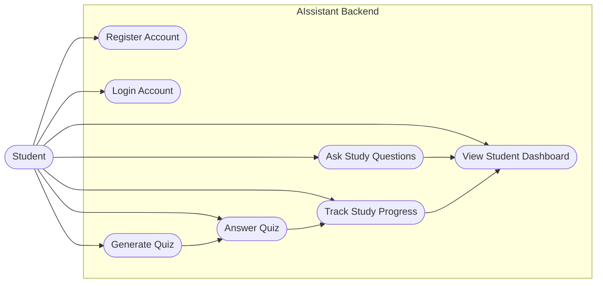
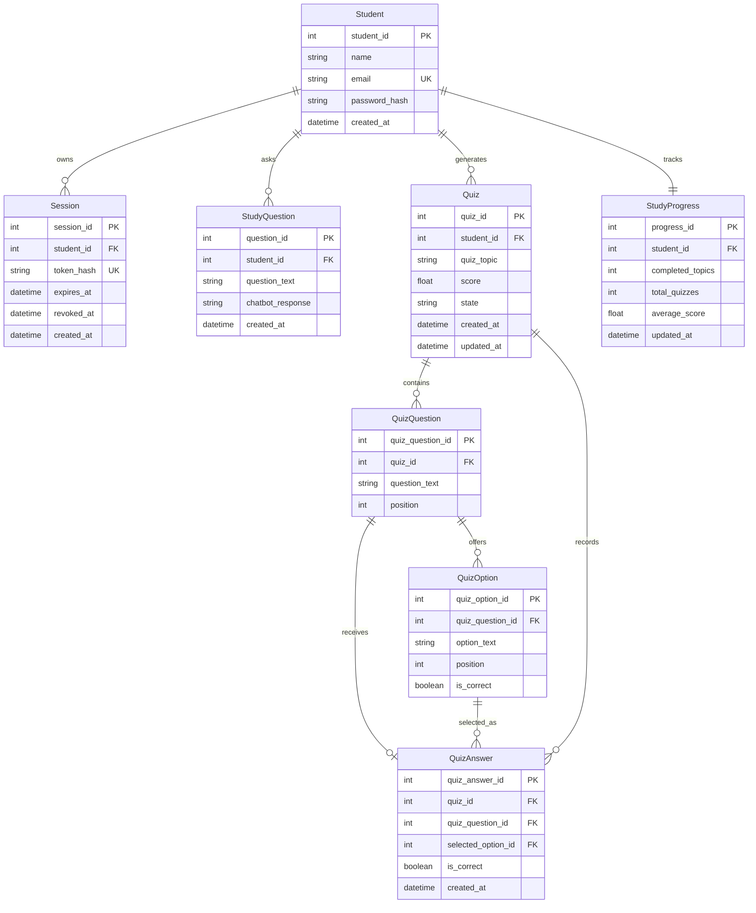
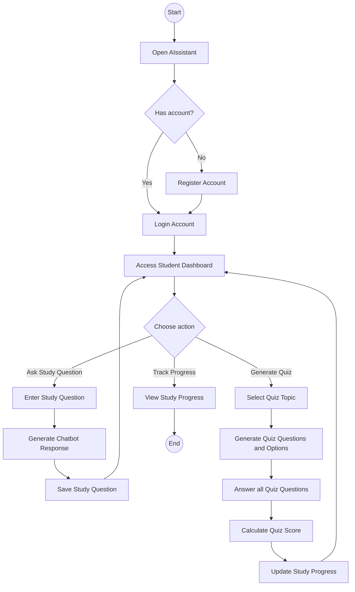
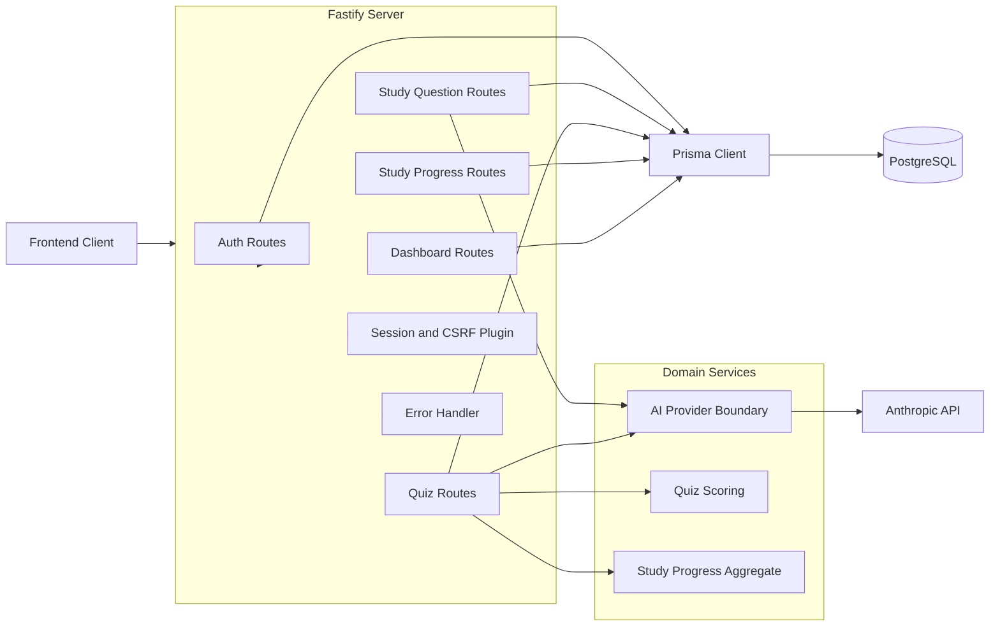
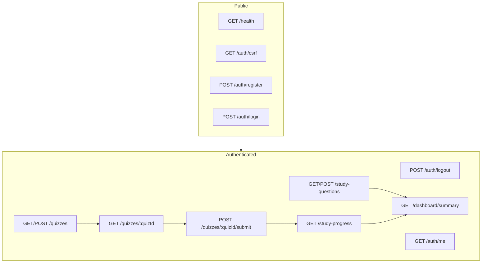

# AIssistant Codebase Diagrams

These diagrams describe the backend after the diagram-domain correction.

## Use Case Diagram

## Persistence ERD

## Activity Diagram

## Backend Route And Module Architecture

## Endpoint Map

